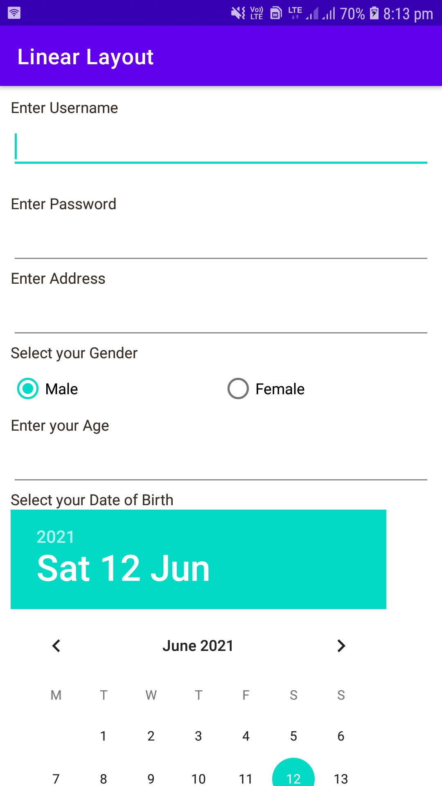
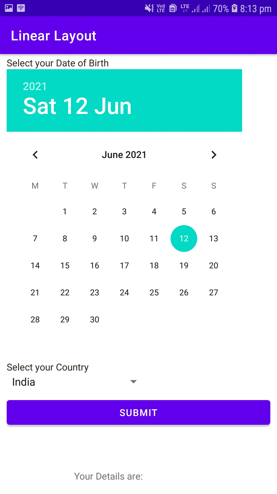
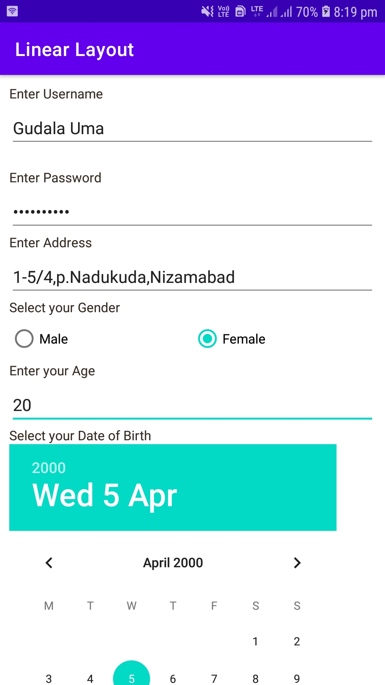
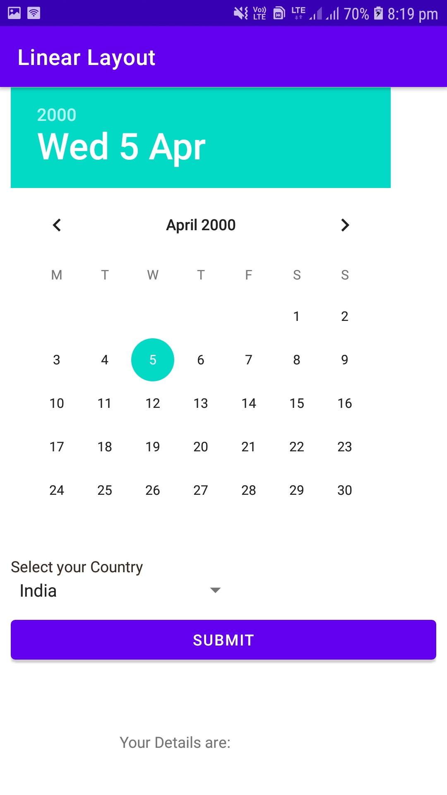
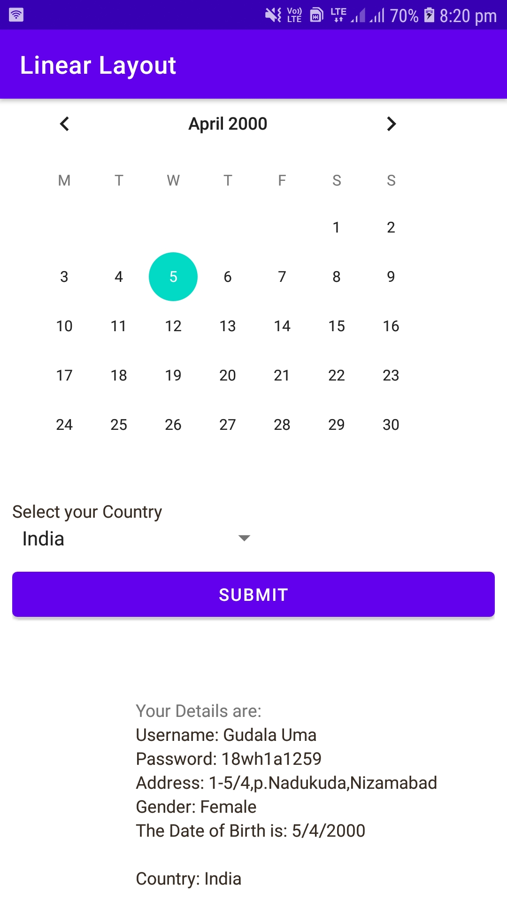

# 2a
Create a screen that has input boxes for User Name, Password, Address, Gender (radio buttons for male and female), Age (numeric), Date of Birth (Date Picker), State(Spinner) and a Submit button. On clicking the submit button, print all the data belowthe Submit Button. Use
(a) Linear Layout
# Output

